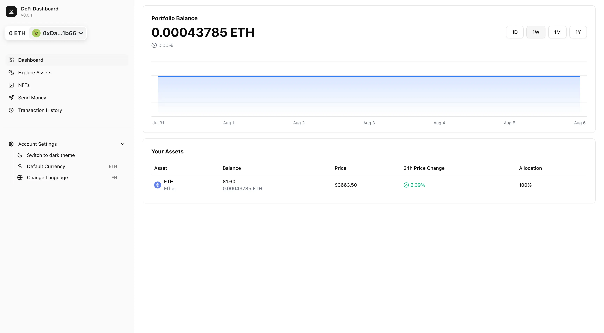

# 🚀 DeFi Dashboard

> **⚠️ Work in Progress (WIP)**  
> This project is currently under active development. Features are being implemented and the application is not yet production-ready. Contributions and feedback are welcome!

## 📸 Preview



_A modern DeFi dashboard with portfolio tracking, wallet integration, and beautiful UI_

## 📖 Description

A modern, responsive DeFi dashboard built with Next.js, featuring real-time portfolio tracking, wallet integration, and multi-language support. Connect your wallet to view your portfolio balance with interactive charts, manage your assets, and track your transaction history.

## ✨ Features

- **📊 Portfolio Balance Tracking** - Real-time balance display with interactive area charts
- **🔗 Wallet Integration** - Seamless connection with RainbowKit and Wagmi
- **🌍 Multi-language Support** - Internationalization with i18next (English & Spanish)
- **🎨 Dark/Light Theme** - Beautiful UI with theme switching
- **📱 Responsive Design** - Optimized for desktop and mobile
- **💼 Asset Management** - View and manage your DeFi assets
- **📜 Transaction History** - Track your DeFi transactions
- **🖼️ NFT Gallery** - Browse your NFT collection
- **📈 Timeframe Charts** - View portfolio performance over 1D, 1W, 1M, 1Y periods

## 🛠️ Tech Stack

- **Framework**: Next.js 15 with App Router
- **Language**: TypeScript
- **Styling**: Tailwind CSS
- **Wallet**: RainbowKit + Wagmi
- **Charts**: Recharts
- **UI Components**: Radix UI
- **Internationalization**: i18next
- **State Management**: React Query
- **Blockchain**: Viem

## 🚀 Getting Started

### Prerequisites

- Node.js 18+
- npm or yarn

### Installation

1. **Clone the repository**

   ```bash
   git clone https://github.com/yourusername/defi-dashboard.git
   cd defi-dashboard
   ```

2. **Install dependencies**

   ```bash
   npm install
   # or
   yarn install
   ```

3. **Run the development server**

   ```bash
   npm run dev
   # or
   yarn dev
   ```

4. **Open your browser**
   Navigate to [http://localhost:3000](http://localhost:3000)

## 📁 Project Structure

```
src/
├── app/                    # Next.js app router pages
│   ├── [locale]/          # Internationalized routes
│   │   ├── assets/        # Assets management page
│   │   ├── nfts/          # NFT gallery page
│   │   ├── send-money/    # Send money page
│   │   └── transaction-history/ # Transaction history page
├── components/            # React components
│   ├── dashboard/         # Dashboard-specific components
│   ├── portfolio/         # Portfolio-related components
│   ├── shared/           # Shared components
│   ├── sidebar/          # Sidebar components
│   └── ui/               # UI components
├── hooks/                # Custom React hooks
├── i18n/                 # Internationalization
├── types/                # TypeScript type definitions
└── utils/                # Utility functions
```

## 🔧 Available Scripts

- `npm run dev` - Start development server
- `npm run build` - Build for production
- `npm run start` - Start production server
- `npm run lint` - Run ESLint

## 🤝 Contributing

1. Fork the repository
2. Create your feature branch (`git checkout -b feature/amazing-feature`)
3. Commit your changes (`git commit -m 'Add some amazing feature'`)
4. Push to the branch (`git push origin feature/amazing-feature`)
5. Open a Pull Request

## 📝 License

This project is licensed under the MIT License - see the [LICENSE](LICENSE) file for details.

## 🙏 Acknowledgments

- [RainbowKit](https://rainbowkit.com/) for wallet integration
- [Wagmi](https://wagmi.sh/) for React hooks for Ethereum
- [Recharts](https://recharts.org/) for beautiful charts
- [Radix UI](https://www.radix-ui.com/) for accessible components

---

**⭐ Star this repository if you find it helpful!**
